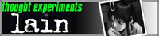

Below is a slew of blogs and sites I frequent for various reasons.

## Mathematics blogs

* [Rising Sea](http://therisingsea.org/)
* [Peter Bielmans](https://pbelmans.ncag.info/)
* [jrs](http://www.math.lsa.umich.edu/~jrs/)
* [castel.dev](https://castel.dev/)
* [Ben Lynn](https://crypto.stanford.edu/~blynn/)
* [GaTech MSR](http://people.math.gatech.edu/~dmargalit7/tsr/index.shtml)
* [Matt Might](http://matt.might.net/articles/)
* [Paul Garrett](https://www-users.cse.umn.edu/~garrett/)
* [Alexey Guzey](https://guzey.com/)

## CS Blogs
* [0x46](https://0x46.net/)
* [ReasonableDeviations](https://reasonabledeviations.com/)

## Cybersecurity blogs
* [vxunderground](https://vx-underground.org/)
* [tmpout](https://tmpout.sh/)
* [phrack](http://www.phrack.org/)
* [Paged Out](https://pagedout.institute/)

## Otaku blogs




## Music Blogs

* [Denpa Guide](http://denpa.omaera.org/)
* [Sophie's Floorboard](http://sophiesfloorboard.blogspot.com/)
